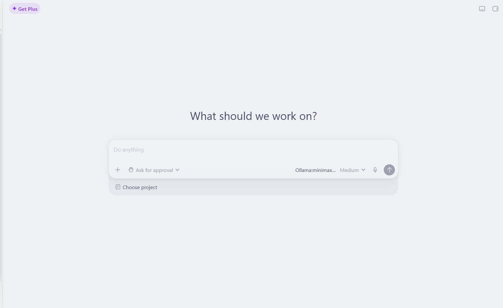
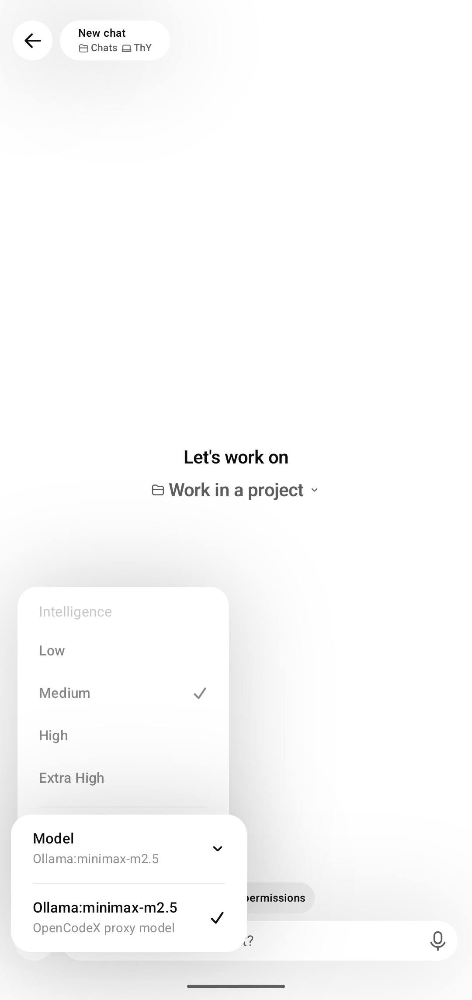
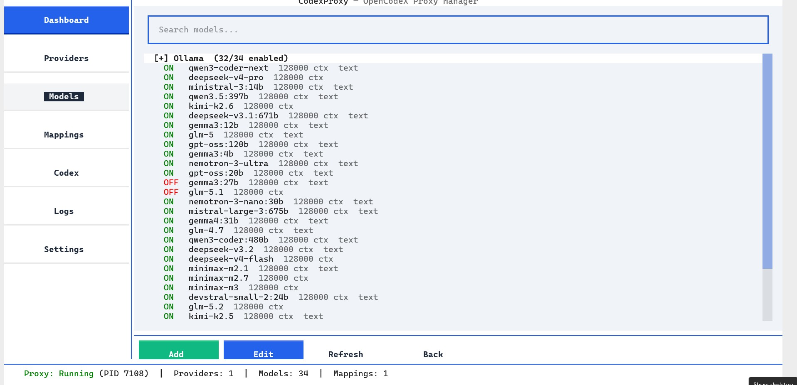

# OpenCodeX Proxy

[](https://opensource.org/licenses/MIT)
[](https://github.com/thyjeff/opencodex/releases)

Use your [OpenCodeX](https://opencode.ai/docs/go) subscription in the [Codex app](https://github.com/openai/codex).
Plus a full TUI manager for providers, models, mappings, and Codex config.

Codex expects a Responses API (`/v1/responses`). OpenCodeX exposes an OpenAI-compatible
Chat Completions API (`/v1/chat/completions`). This proxy bridges that gap in one local process:

```text
Codex app
    │
    │  POST /v1/responses (Responses API)
    ▼
opencodex  ←── localhost:8787, stdlib only
    │
    │  POST /v1/chat/completions (Chat Completions API)
    ▼
Any OpenAI-compatible provider → fetched and custom models
```

## Screenshots

**Codex desktop with OpenCodeX proxy model selected:**


**Codex mobile app with OpenCodeX proxy mode:**


**OpenCodeX TUI manager:**


## Windows EXE

### Download and use

1. [Download `opencodex.exe`](https://github.com/thyjeff/opencodex/releases/latest/download/opencodex.exe).
2. Save it in a folder you can write to, such as `C:\Tools\OpenCodeX`.
3. Double-click it to open the manager, or run it from PowerShell.

No Python, `uv`, or other runtime is required.

To use the normal `opencodex` commands from any folder, run this once in the folder containing the executable:

```powershell
.\opencodex.exe install
```

Close and reopen PowerShell or Command Prompt. Then these work globally:

```powershell
opencodex                 # Open the TUI manager
opencodex start           # Start proxy, update Codex, restart Codex
opencodex stop            # Stop proxy and restore Codex config
opencodex restart         # Restart proxy and Codex integration
opencodex status          # Show proxy and Codex status
opencodex models          # List models from the local proxy
opencodex config          # Open the configuration manager
```

Inside the TUI, use `Ctrl+S` to start and integrate with Codex, `Ctrl+E` to stop, `F5` to refresh, and `Q` to quit.

Maintainers can build the executable locally with:

```powershell
uv sync --group build
uv run --group build pyinstaller --noconfirm --clean --onefile --console --name opencodex --paths src --add-data "contrib/opencodex-catalog.json;contrib" --collect-all textual --hidden-import opencodex_proxy.app --hidden-import opencodex_proxy.protocol --hidden-import opencodex_proxy.tui opencodex.py
```

The result is `dist\opencodex.exe`.

### Custom models

In the standalone manager, open **Models**, click **Add**, then choose **Add
custom model**. Select the provider, enter the exact upstream model ID, and
optionally set its context window. Custom models remain available after you
fetch the provider's discovered model list again.

### Updating the executable

Close OpenCodeX, download the newest `opencodex.exe` from its release, and
replace the old file with the downloaded file. Your provider and model settings
are stored in your user configuration directory, so replacing the executable
does not remove them.

### Sandbox troubleshooting

If Codex shows a sandbox error after starting the proxy:

1. Confirm you use a real OpenAI-compatible provider URL and a valid API key, then use **Test** and **Fetch models** in the TUI.
2. Run `opencodex status` and `opencodex models`; the proxy must be running and list models before opening Codex.
3. Run `opencodex stop`, then `opencodex start` to restore and reapply the Codex configuration.
4. Check `proxy.log` next to `opencodex.exe`. Do not share API keys if you request support.

## Python and uv options

The following alternatives are for developers and source users. They are not needed for the Windows executable.

### One-shot install (uvx)

```bash
# Run the proxy directly from GitHub
uvx --from git+https://github.com/thyjeff/opencodex opencodex --help
```

### Install as a tool

```bash
# Install opencodex as a CLI tool
uv tool install git+https://github.com/thyjeff/opencodex

# Now you can use it from anywhere:
opencodex start       # Start proxy + restart Codex
opencodex stop        # Stop proxy + restore Codex
opencodex tui         # Launch interactive TUI manager
opencodex status      # Show proxy + Codex status
opencodex models      # List available models
```

### From source

```bash
git clone https://github.com/thyjeff/opencodex
cd opencodex
uv sync
uv run opencodex tui
```

## CLI commands

| Command | Description |
|---------|-------------|
| `opencodex` or `opencodex tui` | Launch interactive TUI manager |
| `opencodex start` | Start proxy + restart Codex with proxy profile |
| `opencodex stop` | Stop proxy + restore original Codex config |
| `opencodex restart` | Stop then start |
| `opencodex status` | Show proxy and Codex status |
| `opencodex config` | Open config editor (TUI) |
| `opencodex models` | List available models from proxy |
| `opencodex discover URL` | Discover models from a URL |
| `opencodex --version` | Show version |
| `opencodex --help` | Show help |

## TUI manager

Run `opencodex tui` for a full interactive manager with:

- **Dashboard** — live proxy status, quick actions, provider/mapping overview
- **Providers** — add/edit/delete/test providers, auto-fetch models
- **Models** — browse, toggle ON/OFF, expand/collapse provider groups, edit context window
- **Mappings** — map Codex model names to provider targets (with search)
- **Codex** — config management, backup/restore, restart
- **Logs** — real-time proxy log viewer
- **Settings** — config file paths and defaults

Keyboard shortcuts: `Ctrl+S` start, `Ctrl+E` stop, `F5` refresh, `Esc` back.

## Providers & Models

OpenCodeX is not limited to a fixed set of models — you bring your own backends.
Add **any number of providers** (OpenCodeX, Ollama, vLLM, OpenRouter, LM Studio, a
remote OpenAI-compatible endpoint, …) and **any number of models** under each one. The
proxy aggregates them all behind a single local `http://127.0.0.1:8787` endpoint that
Codex talks to.

How it fits together:

- **Providers** — each provider points at a base URL + API key. Add as many as you like;
  the TUI auto-fetches the model list from each one.
- **Models** — every model discovered from a provider is listed. Toggle them ON/OFF,
  expand/collapse by provider, and edit each model's context window from the TUI.
- **Mappings** — map any Codex model name (e.g. `gpt-5.5`) to a target of the form
  `Provider:model-id` (e.g. `Ollama:minimax-m2.5`). Codex only ever sees the mapped
  name; the proxy routes it to the real backend. Type-to-search makes picking a target
  fast, and you can also type a custom target by hand.

Example: map a friendly name to a local Ollama model, or expose a whole provider's
catalog to Codex under one profile. There is no hard limit — add one provider or fifty,
one model or a thousand.

```bash
opencodex tui        # add providers, toggle models, create mappings visually
opencodex start      # apply config + restart Codex so the models show up
```

## Why

OpenCodeX is $5 for the first month, then $10/month. You get access to 13 open coding models
hosted in the US, EU, and Singapore. Codex is a great agent but doesn't speak Chat Completions
natively — it requires Responses-shaped providers. This proxy fixes that.

## Features

- **Unified local gateway** — one `http://127.0.0.1:8787` endpoint for every provider you add; Codex only needs a single `opencodex` provider block.
- **Any number of providers & models** — OpenCodeX, Ollama, vLLM, OpenRouter, LM Studio, or any OpenAI-compatible endpoint. Add as many as you want; the TUI auto-fetches each provider's model list.
- **Model name mapping** — expose any backend model to Codex under a friendly name (e.g. `gpt-5.5` → `Ollama:minimax-m2.5`). Type-to-search target picker plus free-form custom targets.
- **Full TUI manager** — Dashboard, Providers, Models, Mappings, Codex, Logs, and Settings screens. Toggle models ON/OFF, collapse provider groups, and edit each model's context window inline.
- **One-command lifecycle** — `opencodex start` launches the proxy, writes the Codex model catalog, and restarts Codex; `opencodex stop` tears it down and restores your original config.
- **Responses ↔ Chat Completions translation** — full `input`→`messages` conversion, `instructions`/`developer` roles, function-tool schema passthrough, and reasoning-content replay across tool-call turns.
- **Live streaming** — real SSE streaming (not synthesized) so Codex shows token-by-token output and thinking.
- **Image captioning** — routes image turns with tools to a vision model, then continues the main turn on your chosen model.
- **Safe by default** — binds to `127.0.0.1` only, SSRF-protected image URLs (`https://` and `data:image/` only), and a configurable request body cap.
- **Codex config safety** — automatic backup/restore of `~/.codex/config.toml`, so stopping always returns Codex to its original state.
- **Cross-platform** — runs on macOS and Windows (Codex desktop app); Linux works for the proxy + CLI.

## API key

The proxy resolves your OpenCodeX API key in this order:

1. `$OPENCODE_GO_API_KEY` environment variable
2. macOS keychain entry `opencodex-api-key` (macOS only)

```bash
# Option 1: env var (works everywhere)
export OPENCODE_GO_API_KEY="your-key-here"

# Option 2: macOS keychain (macOS only)
security add-generic-password -a "$USER" -s opencodex-api-key -w
```

Get your API key from [OpenCode Zen](https://opencode.ai/zen) after subscribing to Go.

## Troubleshooting

**Model metadata warning every turn**
Run `opencodex start` — it automatically copies the reference catalog to the right location.

**Connection refused on localhost:8787**
Proxy isn't running. Start it: `opencodex start` or check `opencodex status`.

**API key not found**
Set `OPENCODE_GO_API_KEY` env var or add to macOS keychain.

**Upstream rate limited (429)**
OpenCodeX has usage limits. Switch to a cheaper model (DeepSeek V4 Flash or MiMo V2.5).

## License

MIT. See [LICENSE](LICENSE).
